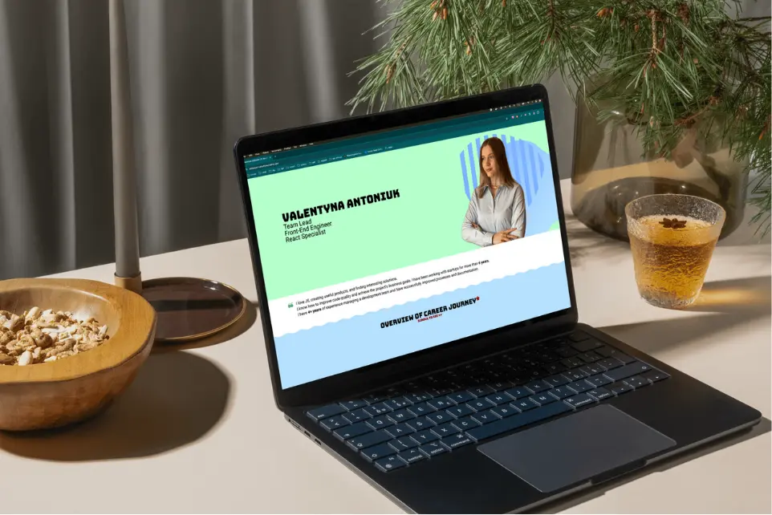
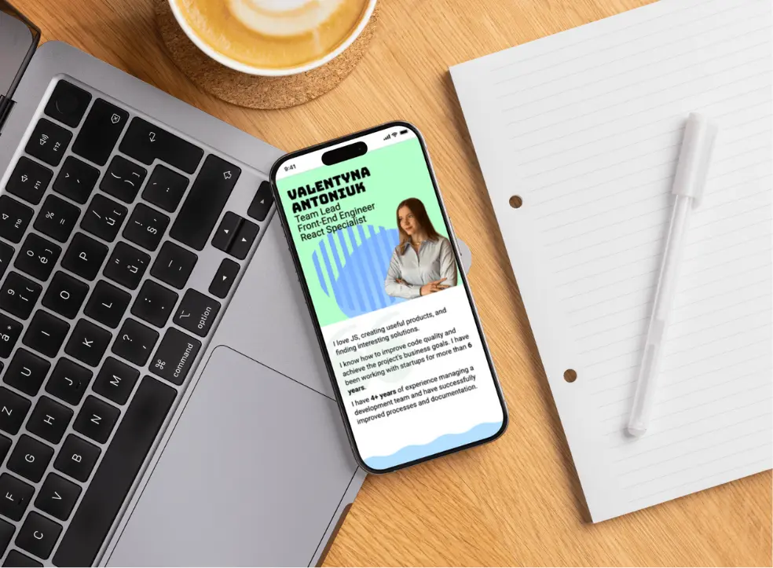

# Personal Website of Valentyna Antoniuk

## Description
The goal of this project is to build a minimal personal CV website to present basic information and work experience.  
An additional goal is to explore and better understand how Astro works by using it in a real-world project.

## ⚒️ Instruments
This project uses **[Astro](https://astro.build/)** for its simplicity and performance-first approach, making it ideal for small, static sites like a CV.
**[React](https://reactjs.org/)** is integrated for building dynamic and reusable UI components with ease.
**[CSS Modules](https://github.com/css-modules/css-modules)** offer scoped styling without the overhead of a larger styling solution, keeping the project lightweight and maintainable.
Together, these tools enable fast development, a clean codebase, and excellent performance for a personal website.

## 🎨 UI / UX
Desktop       |  Mobile
:-------------------------:|:-------------------------:
 |  

## 📅 Plans for improvements
 
- **Pet Projects page**: with more than one example (insert emodji here with symbols);
- **Pet Project Details page**;
- Improve **mobile markup**;
- **Add SEO**:if applicable & needed with a new domain.
